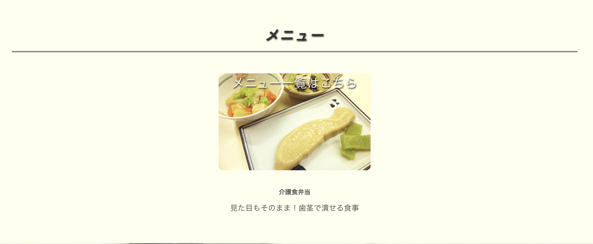
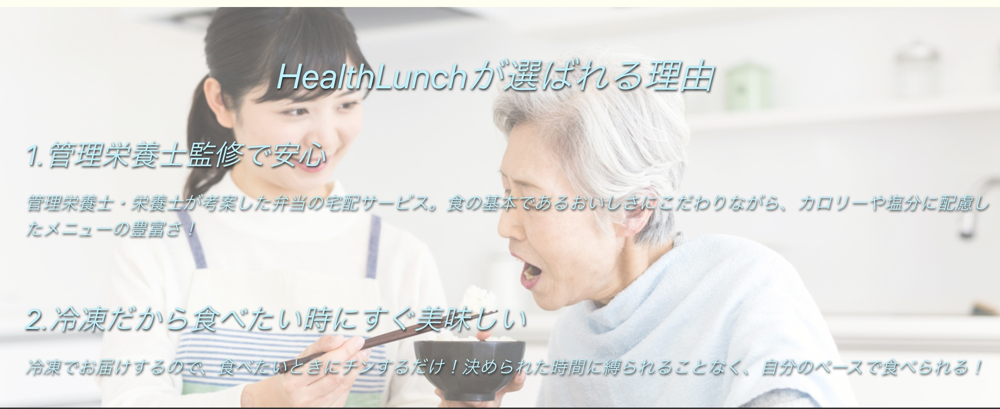
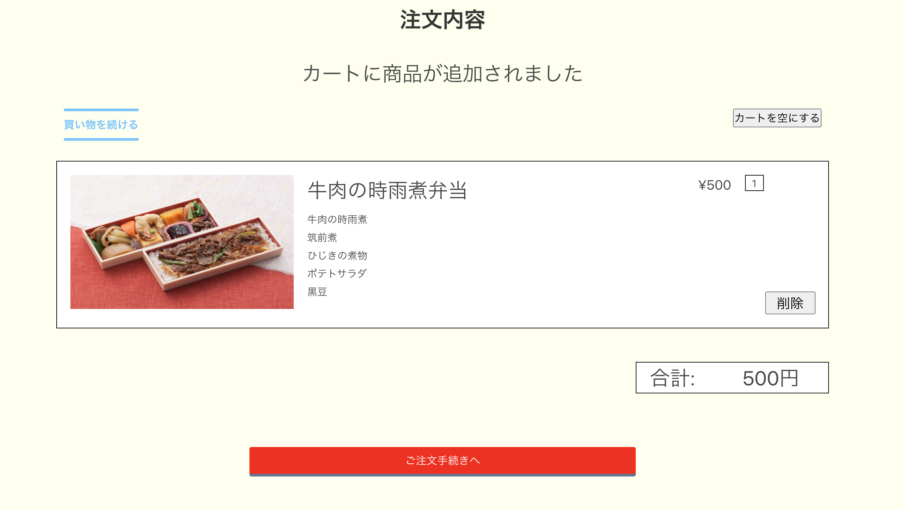
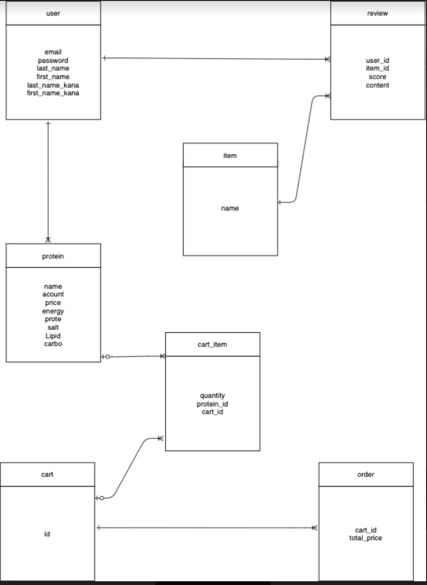

# HealthLunch

# 概要
 .商品購入機能 
 .ユーザー管理機能(devise) 
 .SNSアカウントログイン機能 
 .レビュー機能 
 .レーティング機能 
 .カート機能 
 .管理者機能(admin) 

# アプリURL
https://health-lunch.herokuapp.com/

# 制作背景
高齢化が進む現在、自宅に居ながら病院食と同じように栄養を考え調理することは非常に手間がかかります。
ご両親の介護をされている方、召し上がられるご高齢者の方が安心・安全で「食」という観点から健康的な生活ができるように作成致しました。

# テスト用アカウント
購入者
メールアドレス   ：　sho@ezweb.ne.jp
 パスワード   ：　sho12345

# DEMO

# １　トップページ

# 2 新規登録画面

# 3 ログイン画面

# 4 詳細画面

# 5 カート画面

# 6 レビュー機能   
 
                           

# レスポンシブ

# 工夫ポイント
レイアウト
文字の大きさ、色合い、40代〜60代の方が見やすいようにシンプルにコーティングしました。

# レビュー機能
詳細画面を見やすく、操作を簡単にしました。
認知度が低い介護食という観点から、レビュー機能を実装することにより、介護弁当の評価を実際に召し上がったユーザーに評価して頂き認知度を広めることを目的に作成しました。

# 環境開発
HTML CSS Ruby RubyonRails Javascript Heroku Git 

# 課題
メニューが1種類のみなので選択できるメニューを増やす予定です。

# ER図

# データベース設計
## users テーブル

| Column              | Type   | Options     |
| --------------------| ------ | ----------- |
| email               | string | null: false |
| password            | string | null: false |
| last_name           | string | null: false |
| first_name          | string | null: false |
| last_name_kana      | string | null: false |
| first_name_kana     | string | null: false |

association
 has_many :items
 has_many :buyers
 has_many :reviwes

## items テーブル

| Column              | Type   | Options     |
| --------------------| ------ | ----------- |
| name                | string | null: false |

associaiton
 belongs_to :user

## protein テーブル

| Column             | Type   | Options     |
|--------------------| ------ | ----------- |
| name               | string | null: false |
| acount             | string | null: false |
| price              | string | null: false |
| energy             | string | null: false |
| prote              | string | null: false |
| salt               | string | null: false |
| Lipid              | string | null: false |
| carbo              | string | null: false |

association 
 has_many :users
 belongs_to :protein

## review テーブル

| Column     | Type        | Options                        |
|------------|-------------|--------------------------------|
| user_id    |integer      | null: false, foreign_key: true |
| item_id    |integer      | null: false foreign_key: true |
| score      |string       | null: false                    |
| content    |string       | null: false                    |

association
 belongs_to :user

## cart テーブル
| Column     | Type        | Options                        |
|------------|-------------|--------------------------------|
| id　　　    |integer      | null: false, foreign_key: true |

association
 has_many :cart-item

## cart-item テーブル
| Column     | Type        | Options                        |
|------------|-------------|--------------------------------|
| user_id    |integer      | null: false, foreign_key: true |
| item_id    |integer      | null: false foreign_key: true |
| score      |string       | null: false                    |
| content    |string       | null: false                    |

association
 belongs_to :protein
 belongs_to :cart

## order テーブル
| Column        | Type        | Options                        |
|---------------|-------------|--------------------------------|
| cart_id       |integer      | null: false, foreign_key: true |
| total_parice  |integer      | null: false foreign_key: true  |

association
 has_one :purchase
 belongs_to :cart

