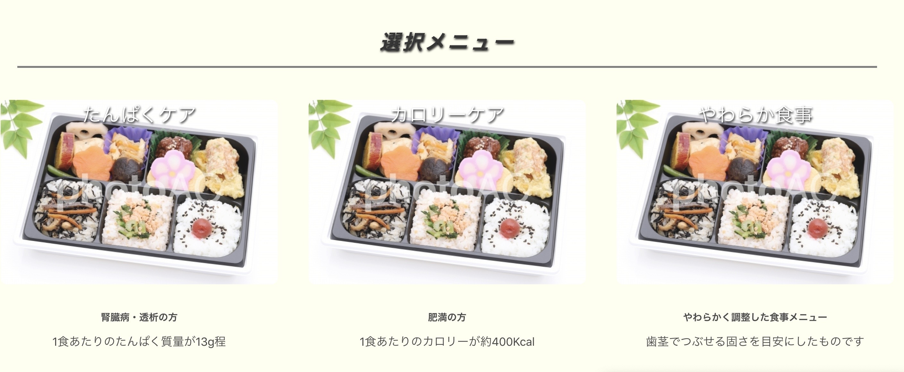
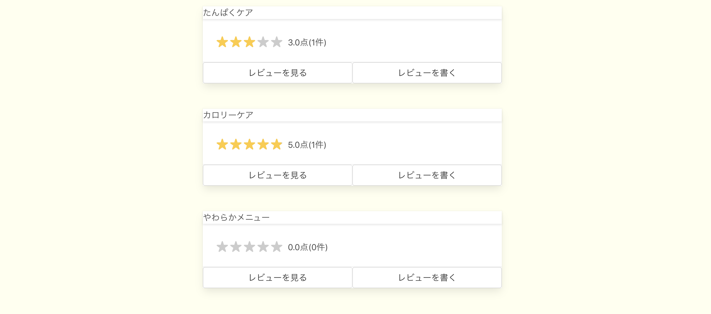
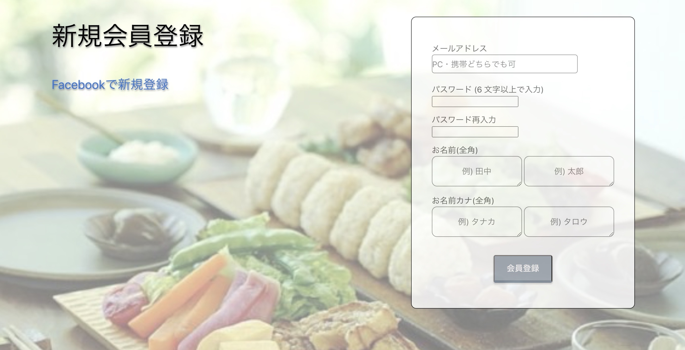
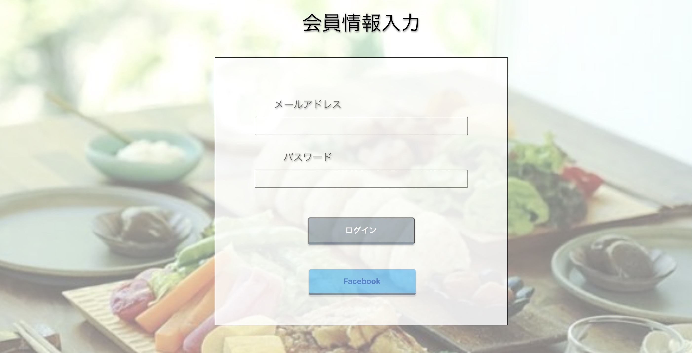
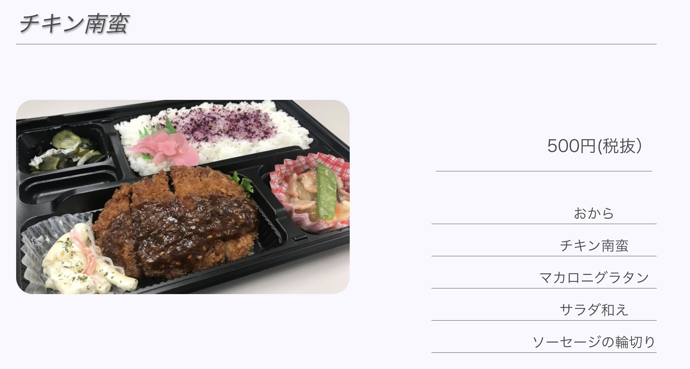
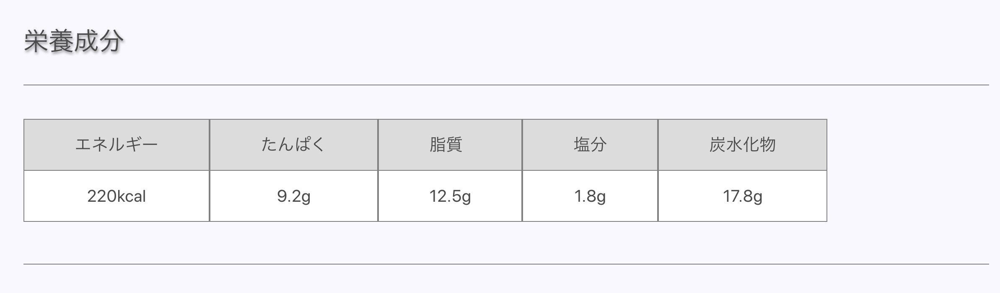
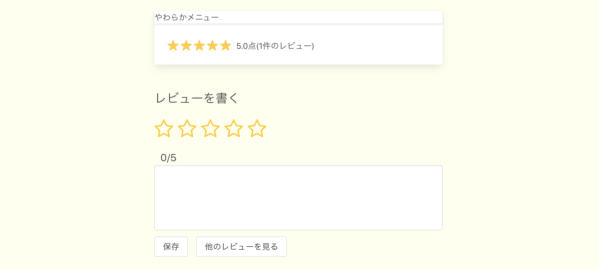
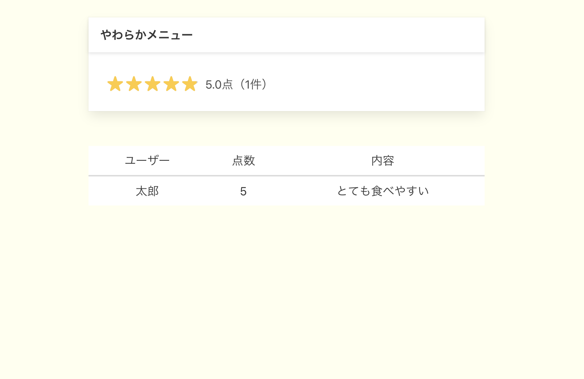

# HealthLunch

# 概要
 .商品購入機能 
 .ユーザー管理機能(devise) 
 .SNSアカウントログイン機能 
 .レビュー機能 
 .レーティング機能 
 .管理者機能(admin) 

# アプリURL
https://health-lunch.herokuapp.com/

# 制作背景
高齢化が進む現在、自宅に居ながら病院食と同じように栄養を考え調理することは非常に手間がかかります。
ご両親の介護をされている方、召し上がられるご高齢者の方が安心・安全で「食」という観点から健康的な生活ができるように作成致しました。

# 特徴
１　トップページ

2 新規登録画面

3 ログイン画面

4 詳細画面

5 レビュー機能   
 
                           

# 工夫ポイント
レイアウト
文字の大きさ、色合い、40代〜60代の方が見やすいようにシンプルにコーティングしました。

レビュー機能
詳細画面を見やすく、操作を簡単にしました。
認知度が低い介護食という観点から、レビュー機能を実装することにより、介護弁当の評価を実際に召し上がったユーザーに評価して頂き認知度を広めることを目的に作成しました。

# 環境開発
Ruby RubyonRails Javascript Heroku 

# 課題
商品が１品ずつしか購入できない仕様になっているため、買い物カゴ機能の実装を行い、複数商品購入できるような仕様にして行きたいと考えています。

# データベース設計
## users テーブル

| Column              | Type   | Options     |
| --------------------| ------ | ----------- |
| email               | string | null: false |
| password            | string | null: false |
| last_name           | string | null: false |
| first_name          | string | null: false |
| last_name_kana      | string | null: false |
| first_name_kana     | string | null: false |

association
 has_many :items
 has_many :buyers
 has_many :reviwes

## items テーブル

| Column              | Type   | Options     |
| --------------------| ------ | ----------- |
| name                | string | null: false |

associaiton
 belongs_to :user

## protein テーブル

| Column             | Type   | Options     |
|--------------------| ------ | ----------- |
| name               | string | null: false |
| acount             | string | null: false |
| price              | string | null: false |
| energy             | string | null: false |
| prote              | string | null: false |
| salt               | string | null: false |
| Lipid              | string | null: false |
| carbo              | string | null: false |

association 
 has_many :users
 belongs_to :protein

## soft テーブル
| Column              | Type   | Options     |
| --------------------| ------ | ----------- |
| name                | string | null: false |
| acount              | string | null: false |
| price               | string | null: false |
| energy              | string | null: false |
| prote               | string | null: false |
| salt                | string | null: false |
| Lipid               | string | null: false |
| carbo               | string | null: false |

association 
 has_many :users
 belongs_to :soft

## calo テーブル

| Column             | Type   | Options     |
|--------------------| ------ | ----------- |
| name               | string | null: false |
| acount             | string | null: false |
| price              | string | null: false |
| energy             | string | null: false |
| prote              | string | null: false |
| salt               | string | null: false |
| Lipid              | string | null: false |
| carbo              | string | null: false |

association 
 has_many :users
 belongs_to :calo

## buyer テーブル

| Column            | Type       | Options                       |
|-------------------|------------|-------------------------------|
| user_id           | integer    | null: false, foreign_key: true|
| protein_id        | integer    | null: false, foreign_key: true|

association
 belongs_to :protein
 belongs_to :user
 has_one :delivery

## bento テーブル

| Column         | Type    | Options                       |
|----------------|---------|-------------------------------|
| user_id        | integer | null: false, foreign_key: true|
| calo_id        | integer | null: false, foreign_key: true|
| user_id        | integer | null: false, foreign_key: true|
| calo_id        | integer | null: false, foreign_key: true|

association
 belongs_to :calo
 belongs_to :user
 has_one: :deli

## shohin テーブル

| Column         | Type    | Options                       |
|----------------|---------|-------------------------------|
| user_id        | integer | null: false, foreign_key: true|
| soft_id        | integer | null: false, foreign_key: true|
| user_id        | integer | null: false, foreign_key: true|
| soft_id        | integer | null: false, foreign_key: true|

association
 belongs_to :soft
 belongs_to :user
 has_one :add

## delivery テーブル

| Column        | Type       | Options                        |
|---------------|------------|--------------------------------|
| buyer_id      | integer    | null: false, foreign_key: true |
| zip           | string     | null: false                    |
| region_id     | integer    | null: false                    |
| city          | string     | null: false                    |
| reference     | string     | null: false                    |
| building      | string     |                                |
| phone_number  | string     | null: false                    |

association
 has_one :buyer

## deli テーブル

| Column        | Type       | Options                        |
|---------------|------------|--------------------------------|
| calo_id       | integer    | null: false, foreign_key: true |
| zip           | string     | null: false                    |
| region_id     | integer    | null: false                    |
| city          | string     | null: false                    |
| reference     | string     | null: false                    |
| building      | string     |                                |
| phone_number  | string     | null: false                    |

association
 has_one :bento

## add テーブル

| Column        | Type       | Options                        |
|---------------|------------|--------------------------------|
| soft_id       | integer    | null: false, foreign_key: true |
| zip           | string     | null: false                    |
| region_id     | integer    | null: false                    |
| city          | string     | null: false                    |
| reference     | string     | null: false                    |
| building      | string     |                                |
| phone_number  | string     | null: false                    |

association
 has_one :shohin

## review テーブル

| Column     | Type        | Options                        |
|------------|-------------|--------------------------------|
| user_id    |integer      | null: false, foreign_key: true |
| item_id    |integer      | null: false. foreign_key: true |
| score      |string       | null: false                    |
| content    |string       | null: false                    |

association
 belongs_to :user
